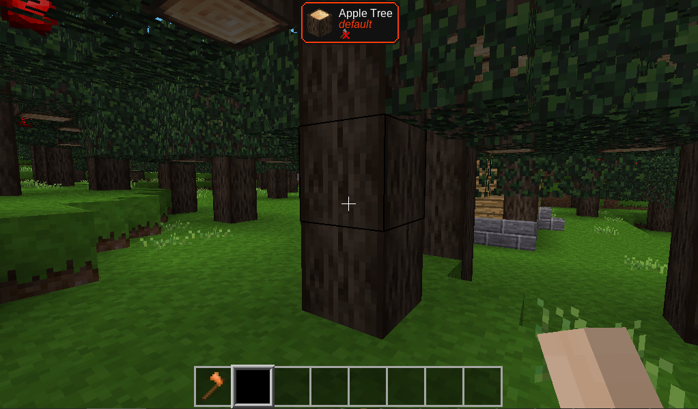
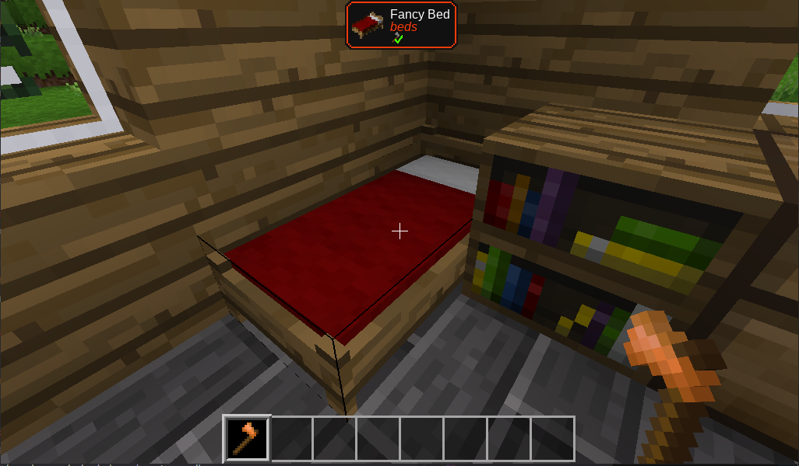
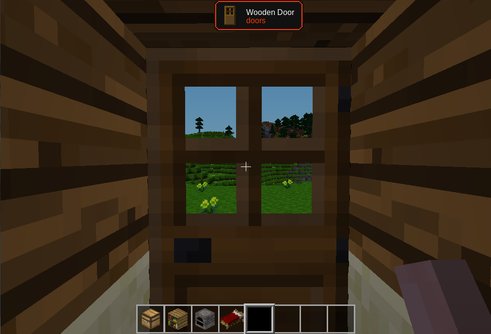
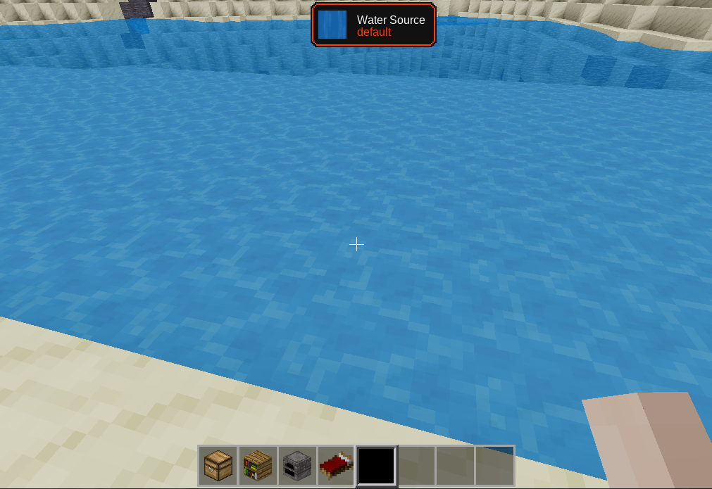

# What is this? UwU
[](https://content.minetest.net/packages/Rotfuchs-von-Vulpes/what_is_this_uwu/)
[](https://content.minetest.net/packages/Rotfuchs-von-Vulpes/what_is_this_uwu/)

A mod that says at the top of your screen what you're looking at.
Modified by kebabmaneater to be centered and have the tool shown.

Also supports Extended Tooltips https://content.minetest.net/packages/Wuzzy/tt/

## Screenshots:









## Chatcommands

To unshow thw pop-up, typed this in console:

```
/wituwu
```

And typed again to show.

Enjoy! 🦊
